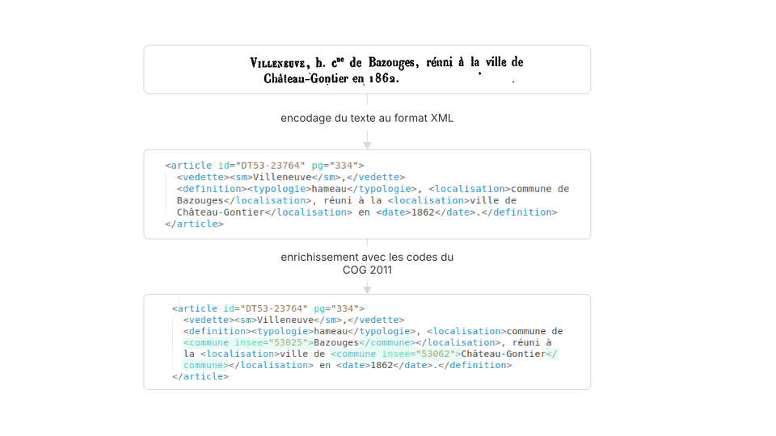
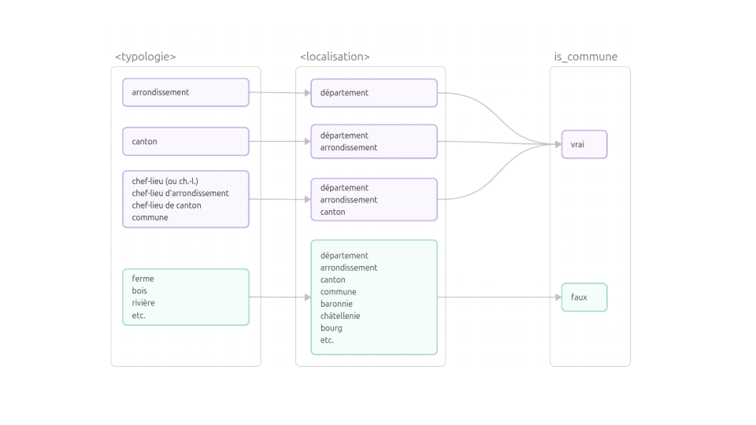
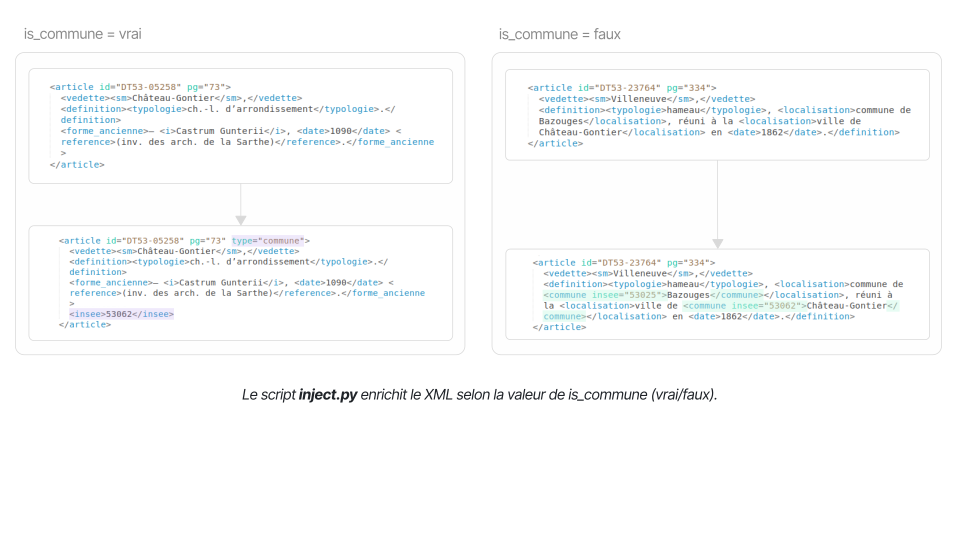

# Géoréférencer les Dictionnaires topographiques départementaux de la France

L'application [DicoTopo](https://dicotopo.cths.fr/) réunit en une base de données unique l'ensemble des dictionnaires topographiques départementaux publiés depuis le XIXe siècle. Ce dépôt regroupe les scripts qui enrichissent ces données avec les codes du Code officiel géographique (COG) de 2011. Ce géoréférencement permet de cartographier les toponymes et d'assurer l'interrogation et l'interopérabilité du corpus à travers sa dimension spatiale.[^1] À titre d'exemple, la chaîne de traitement est illustrée par le Dictionnaire topographique du département de la Mayenne, disponible sur [Gallica](https://gallica.bnf.fr/ark:/12148/bpt6k204189z/f55.item).



Vue d'ensemble de la chaîne de traitement :

| Étape              | Input                                                                                      | Output               |
| ------------------ | ------------------------------------------------------------------------------------------ | -------------------- |
| [parse.py](#parsepy)          | DT53.xml                                                                                   | DT53_parsed.xlsx     |
| [classify.py](#classifypy)        | DT53_parsed.xlsx                                                                           | DT53_classified.xlsx |
| [recognize.py](#recognizepy)       | DT53_classified.xlsx                                                                       | DT53_recognized.xlsx |
| [match.py](#matchpy)           | DT53_recognized.xlsx<br>DT53_COG_2011.xlsx                                                 | DT53_matched.xlsx    |
| (validation experte) | DT53_matched.xlsx                                                                          | DT53_validated.xlsx  |
| [inject.py](#injectpy)          | DT53_validated.xlsx                                                                        | DT53_injected.xml    |
| [control.py](#controlpy)         | DT53.xml<br>DT53_injected.xml<br>DT53_validated.xlsx<br>DT53_COG_2011.xlsx<br>dicotopo.rng | DT53_controlled.xlsx |

## parse.py	

Ce premier script transforme la structure XML en tableau CSV. Il extrait cinq champs par article : l'identifiant, la vedette (le nom du lieu), la définition, la typologie et la localisation (au format JSON).

Par exemple, l'extrait

```xml
<article id="DT53-23764" pg="334">
    <vedette><sm>Villeneuve</sm>,</vedette>
    <definition><typologie>hameau</typologie>, <localisation>commune de Bazouges</localisation>,réuni à la
    <localisation>ville de Château-Gontier</localisation> en <date>1862</date>.</definition>
</article>
```

devient :

| Champ          | Contenu                                                                  |
| -------------- | ------------------------------------------------------------------------ |
| `id`           | DT53-23764                                                               |
| `vedette`      | Villeneuve                                                               |
| `definition`   | hameau, commune de Bazouges, réuni à la ville de Château-Gontier en 1862 |
| `typologie`    | hameau                                                                   |
| `localisation` | ["commune de Bazouges", "ville de Château-Gontier"]                      |

## classify.py

**classify.py** distingue les communes des autres toponymes (fermes, bois, rivières, etc.). Cette distinction est nécessaire car les communes s'apparient directement au COG par leur vedette, tandis que les autres lieux doivent être géolocalisés indirectement via les communes mentionnées dans leur localisation. Ce script analyse la typologie de chaque entrée : si elle mentionne « arrondissement », « canton », « chef-lieu » ou « commune », l'entrée est identifiée comme une commune (`is_commune: true`). Dans tous les autres cas, elle ne l'est pas (`is_commune: false`). Cette règle ne couvre cependant pas tous les cas (notamment lorsque les typologies sont vides), une validation experte reste nécessaire.



Exemple : Pour l'entrée « Villeneuve », la typologie indique « hameau ». Le script enregistre donc `is_commune: false`, ce qui signale que ce lieu devra être géoréférencé via les communes mentionnées dans sa localisation.

| Champ          | Contenu                                                                  |
| -------------- | ------------------------------------------------------------------------ |
| `id`           | DT53-23764                                                               |
| `vedette`      | Villeneuve                                                               |
| `definition`   | hameau, commune de Bazouges, réuni à la ville de Château-Gontier en 1862 |
| `typologie`    | hameau                                                                   |
| `localisation` | ["commune de Bazouges", "ville de Château-Gontier"]                      |
| `is_commune`   | false                                                                    |

## recognize.py

Il nous faut maintenant extraire les noms de lieux qui permettront l'appariement avec le COG. Pour les communes `is_commune` est vrai, le nom est la vedette elle-même. Pour les autres lieux, il faut identifier la ou les communes mentionnées dans le champ `localisation`.

#### Reconnaissance d'entités nommées

La bibliothèque SpaCy permet de reconnaître automatiquement les entités géopolitiques (GPE) et les lieux géographiques (LOC). Un système de secours basé sur des expressions régulières capture les mots à majuscule initiale en cas d'échec.

#### Normalisation des toponymes

Les toponymes extraits sont normalisés (suppression des articles, apostrophes, tirets et accents, conversion en minuscules) puis les doublons sont éliminés. Les noms normalisés sont enregistrés dans la colonne `commune_norm` au format JSON.

| Champ          | Contenu                                                                  |
| -------------- | ------------------------------------------------------------------------ |
| `id`           | DT53-23764                                                               |
| `vedette`      | Villeneuve                                                               |
| `definition`   | hameau, commune de Bazouges, réuni à la ville de Château-Gontier en 1862 |
| `typologie`    | hameau                                                                   |
| `localisation` | ["commune de Bazouges", "ville de Château-Gontier"]                      |
| `is_commune`   | false                                                                    |
| `commune_norm` | ["bazouges", "chateau gontier"]                                          |

## match.py

Ce script associe chaque toponyme normalisé (clé ou _key_) à un nom du COG (également normalisé) en trois étapes. Chaque correspondance est annotée avec le nom officiel du COG (`NCCENR`), le code du COG (`INSEE`) et la méthode d'appariement utilisée (`match`).

Trois étapes d'appariement :

| Étape                               | Exemple                                                                  | Match |
| ----------------------------------- | ------------------------------------------------------------------------ | ----- |
| key = COG                           | "chateau gontier" correspond à "chateau gontier" ("chateau gontier" = "chateau gontier")                      | exact |
| first_token(key) = first_token(COG) | "couesmes" correspond à "couesmes  vauce" ("couesmes"  = "couesmes" )    | fuzzy |
| key ∈ tokens(COG)                   | "vauce" correspond à "couesmes  vauce" ("vauce" ∈ ["couesmes", "vauce"]) | fuzzy |

Pour chacune de ces trois étapes, un écart d'une lettre est toléré (distance de Levenshtein ≤ 1), permettant par exemple de relier "bazouges" à "bazougers". Lorsqu'une clé correspond à plusieurs communes (par exemple, "deneuille" renvoie à "deneuille les chantelle" et "deneuille les mines"), toutes les correspondances sont référencées avec un match fuzzy également.

Exemple de résultat :

| Champ          | Contenu                                                                  |
| -------------- | ------------------------------------------------------------------------ |
| `id`           | DT53-23764                                                               |
| `vedette`      | Villeneuve                                                               |
| `definition`   | hameau, commune de Bazouges, réuni à la ville de Château-Gontier en 1862 |
| `typologie`    | hameau                                                                   |
| `localisation` | ["commune de Bazouges", "ville de Château-Gontier"]                      |
| `is_commune`   | false                                                                    |
| `commune_norm` | ["bazouges", "chateau gontier"]                                          |
| `NCCENR`       | ["Bazougers", "Château-Gontier"]                                         |
| `INSEE`        | ["53025", "53062"]                                                       |
| `match`        | ["fuzzy", "exact"]                                                       |

## inject.py

**inject.py** enrichit le XML en fonction du statut `is_commune` de chaque article. Lorsque `is_commune` est vrai, l'article reçoit un attribut `type="commune"` et une balise enfant `<insee>` contenant le code COG. Pour les autres articles (`is_commune = false`), chaque commune identifiée dans `<localisation>` est encapsulée dans une balise `<commune insee="...">` avec son code COG en attribut.



## control.py

**to-do : https://github.com/chartes/dico-topo/blob/enrichissement_xml_dt/data/_OUTPUT6_VALDATION_PROCEDURE.md**

Ce dernier script garantit qu'aucune information n'a été perdue ou corrompue lors des enrichissements. Il génère un rapport de contrôle (`DT53_controlled.xlsx`) organisé en trois onglets qui vérifient respectivement l'intégrité du fichier XML, la validité des enrichissements et la conformité XML.

#### Intégrité

Cet onglet compare le fichier XML enrichi (`DT53_injected.xml`) au fichier source (`DT53.xml`) pour détecter toute altération du contenu original.

| Id         | DT53.xml                                               | DT53_injected.xml                                       |
| ---------- | ------------------------------------------------------ | ------------------------------------------------------- |
| DT53-00002 | `<definition>ferme, commune de Brécé.</definition>` | `<definition>ferme., commune de Brécé.</definition>` |
| DT53-00001 | pg="1"                                                 | pg="2"                                                  |
| DT53-00001 | id="DT53-00001"                                        | id="DT53-00002"                                         |
| DT53-00001 | id="DT53-00001"                                        | n/a                                                     |

#### Validité

Cet onglet croise le fichier XML enrichi (`DT53_injected.xml`) avec le tableau validé (`DT53_validated.xlsx`) et la liste du COG 2011 (`DT53_COG_2011.xlsx`) pour identifier les enrichissements manquants ou invalides.

| **Id**     | **Problem**             | **DT03_injected.xml**         | **Correction**                             |
| ---------- | ----------------------- | ----------------------------- | ------------------------------------------ |
| DT53-00308 | attribute_insee_missing | `<commune>Brécé</commune>`      | `<commune insee=53042>Brécé</commune>`       |
| DT53-01126 | attribute_type_missing  | `<article id=DT53-01126 pg=18>` | `<article id=DT53-01126 pg=18 type=commune>` |
| DT53-01126 | balise_insee_missing    | n/a                           | `<insee>53025</insee>`                       |
| DT53-01150 | insee_invalid           | insee=43025                   | insee=53025                                |
| DT53-01126 | insee_invalid           | `<insee>43025</insee>`         | `<insee>53025</insee>`                       |

#### Conformité

Cet onglet vérifie la conformité XML du fichier enrichi en s'assurant qu'il est bien formé et valide selon les règles définies par le schéma dicotopo.rng.

| **Check**       | **Status** | **Error**                                                  |
| --------------- | ---------- | ---------------------------------------------------------- |
| well-formedness | passed     | n/a                                                        |
| dico-topo.rng   | invalid    | line 8: element DICTIONNAIRE failed to validate attributes |
| dico-topo.rng   | invalid    | line 9: element article failed to validate attributes      |
| dico-topo.rng   | invalid    | line 10: element vedette has extra content: pg             |

[^1]: Ce géoréférencement permet notamment de trier et filtrer les résultats selon un découpage administratif, de regrouper les lieux par commune d'appartenance, et de travailler aisément à l'échelle nationale, ce que la fragmentation en dictionnaires départementaux rendait complexe et laborieux.
